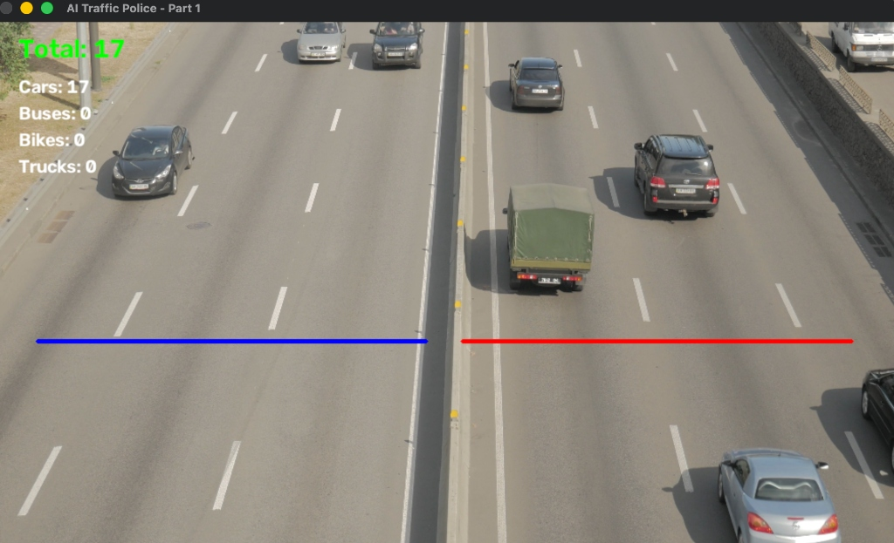

# 🚦 TrafficCV — Traffic Surveillance using a Computer Vision System

> A robust, real-time vehicle detection and multi-class tracking pipeline engineered for automated traffic monitoring and density analysis.

---

## 🔍 Project Overview
Traditional traffic monitoring relies on legacy hardware or manual auditing. This project implements a scalable, modular computer vision pipeline capable of ingesting video feeds, detecting multi-class vehicles, maintaining consistent tracking identities across frames, and executing directional line-crossing analytics.

---

## 📸 Demo Preview


---

## 🛠️ System Architecture & Methodology

1. **Inference Engine (YOLOv8):** 
   - Utilizes a fine-tuned YOLO object detection architecture optimized for bounding-box regression accuracy across varied lighting and scale conditions.
   - Configured with optimized confidence gating (`conf=0.3`) to balance false-positive suppression against small-object detection loss.
2. **Multi-Object Tracking (ByteTrack):** 
   - Integrates ByteTrack (`bytetrack.yaml`) with persistent state tracking (`persist=True`). Unlike frame-by-frame detection, this associates low-score detection boxes to resolve occlusions and prevent redundant counting IDs.
3. **Spatial Tripwire Logic:** 
   - Employs a dual-region vector mapping grid to parse split-highway directions independently (accounting for median barriers and opposing traffic flows). 
   - Evaluates lower-edge bounding box centroids against dynamic frame-height coordinate thresholds to trigger unique ID increments safely.

---

## 📊 Features & Capabilities
* **Multi-Class Classification:** Differentiates between cars, buses, bikes, and trucks in real time.
* **Dual-Lane Directional Counting:** Separates incoming vs. away-bound traffic streams to prevent cross-contamination of metrics.
* **Performance Optimization:** Features dynamic frame scaling matrix adjustments to maintain fluid execution speeds on local hardware.

---

## 🗂️ Tech Stack
* **Language:** Python 3.9+
* **Deep Learning:** Ultralytics YOLOv8, PyTorch
* **Computer Vision:** OpenCV, ByteTrack

---

## 🚀 Installation & Quickstart

1. **Clone the repository:**
   ```bash
   git clone [https://github.com/YOUR_USERNAME/ai-traffic-police.git](https://github.com/YOUR_USERNAME/ai-traffic-police.git)
   cd traffic-surveillance
